# Manas Soni | Full-Stack Developer

<div align="center">



**Student & Developer building automated systems, multi-agent AI networks, and premium web experiences.**

[](https://manassoni-2009.github.io)
[](https://opensource.org/licenses/MIT)

<br/>

<a href="https://manassoni-2009.github.io">
    <picture>
      
    </picture>
</a>

<br/>
<br/>



</div>

## ✨ Key Features

This repository houses a personal portfolio built with a focus on cutting-edge design and fluid performance.

<table>
  <tr>
    <td width="50%">
      <h3>🎨 Modern & Premium UI</h3>
      <p>Crafted with an eye for detail, featuring a dark mode aesthetic (Pitch Dark) with vibrant Neon Green accents.</p>
    </td>
    <td width="50%">
      <h3>🌊 Fluid Animations</h3>
      <p>Powered by <strong>GSAP</strong> and <strong>Lenis</strong> for smooth scrolling, parallax effects, and staggered reveals.</p>
    </td>
  </tr>
  <tr>
    <td width="50%">
      <h3>🖱️ Interactive Elements</h3>
      <p>Custom cursor, magnetic buttons, and a unique horizontal scroll section for projects.</p>
    </td>
    <td width="50%">
      <h3>⚡ Automated Optimization</h3>
      <p>Includes a Python script (<code>optimize.py</code>) to batch convert images to <code>.webp</code> format for enhanced loading speeds.</p>
    </td>
  </tr>
</table>

<div align="center">

</div>

## 🛠️ Tech Stack

### Architecture

* **Frontend:** HTML5, CSS3, JavaScript (Vanilla)
* **Animation:** GSAP (GreenSock)
* **Scrolling:** Lenis
* **Utilities:** Python (Pillow) for Image Processing

<details>
<summary><b>📂 View Repository Structure</b></summary>
<br>

```text
├── assets/         # Images, icons, and visual assets
├── css/            # Stylesheets (style.css)
├── js/             # JavaScript files (main.js)
├── about.html      # About page
├── contact.html    # Contact page
├── index.html      # Main landing page
├── projects.html   # Dedicated projects showcase
└── optimize.py     # Python script for WebP image conversion
```

</details>

<div align="center">

</div>

## 🚀 Quick Start

Launch the project locally in three steps:

1. **Clone the repository:**

   ```bash
   git clone https://github.com/ManasSoni-2009/manassoni-2009.github.io.git
   cd manassoni-2009.github.io
   ```

2. **Run a local server:**

   ```bash
   python -m http.server 8000
   ```

3. **View the experience:**

   Navigate to `http://localhost:8000` in your browser.

<div align="center">

</div>

## 🖼️ Image Optimization System

The repository includes `optimize.py`, a utility to maintain high performance by converting `.png`, `.jpg`, and `.jpeg` assets to `.webp`.

**Setup & Usage:**

```bash
# Install dependencies
pip install Pillow

# Run the optimizer
python optimize.py
```

*(Update the `assets_dir` variable inside `optimize.py` if your paths differ.)*

<div align="center">

</div>

## 🌟 Featured Projects

* **Adobe Stock Automation:** Automated system using Make.com, Imagen 4, and Adobe Firefly to generate and auto-upload AI images.
* **Multi-Agent Blog Network:** Orchestration connecting multiple AI models to fetch news, generate tech blogs, and auto-publish.
* **Algorithmic Visualizer:** A high-performance C++ tool to visualize complex sorting and pathfinding algorithms.

<div align="center">


### 📫 Connect

[Email](mailto:manassoni009@gmail.com) • [LinkedIn](https://linkedin.com/in/manassoni) • [GitHub](https://github.com/ManasSoni-2009) • [Instagram](https://www.instagram.com/theunintentionallyunknown/)

<br>
<br>
<i>Built with raw passion by Manas Soni.</i>
</div>
